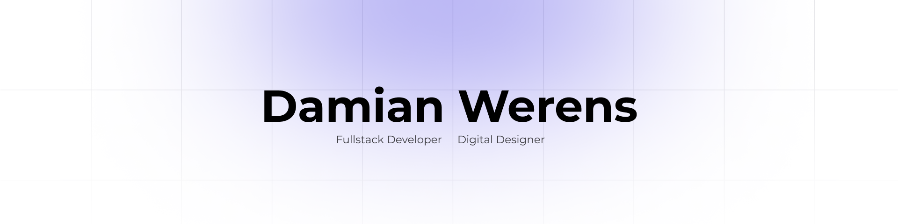

# My personal portfolio 🎉🎈

I decided to create a personal portfolio to showcase my projects and skills. I have been working on this project for a few weeks now and I am excited to share it with you. I hope you enjoy it!

## Table of contents

- [General info](#general-info)
- [Technologies](#technologies)
- [Setup](#setup)
- [Features](#features)
- [Status](#status)
- [Contact](#contact)

## General info

It was built with **React, Next.js, and TailwindCSS**. Before I started writing code I created a design system using **Figma** and I also created a **Storybook** to **document all the components** I would be using in the project. I used the per domain pattern to structure the project, so it **should be easy to maintain and scale**.

Since 2020, It was my dream to create awesome portfolio page that will showcase my skills and projects. I am happy that I **finally** did it.

## Technologies

- React
- Next.js
- TailwindCSS
- Storybook
- Figma
- Jest
- Cypress
- framer-motion

## Setup

1. Clone the repository
2. Run `npm install`
3. Create a `.env.local` file and add the values for the environment variables that are in the `.env.template` file
4. Run `npm run dev` to start the development server
5. Run `npm run storybook` to start the Storybook server
6. Done! 🚀 You can explore my project in the development mode

### How to setup .env.local correctly?

I provide the helpful **accordion with the video or link** that will show you how to setup `.env.local` file correctly. Just click on the accordion and **explore the content**.

<b>SMTP Gmail</b>

- [Node How To Send An Email From Gmail With Nodemailer](https://www.youtube.com/watch?v=cqdAS49RthQ)

<b>Calcom settings</b>

- [Integrating Cal.com Into Your Website Using React: A Step-by-Step Guide](https://medium.com/@hamzabhf00/integrating-cal-com-into-your-website-using-react-a-step-by-step-guide-b9886b8e175f)
- [@calcom/embed-react](https://www.npmjs.com/package/@calcom/embed-react)
- [What can you configure?](https://cal.com/docs/core-features/embed/embed-snippet-generator#what-can-you-configure)

## Features

- **Responsive design**: The website is fully responsive and works on all devices
- **Dark mode**: You can switch between light and dark mode
- **Animations**: I used framer-motion to create animations
- **Storybook**: I created a Storybook to document all the components
- **Design system**: I created a design system using Figma
- **SEO**: I used Next.js to improve the SEO of the website
- **Tests**: I wrote tests using Jest and Cypress

## Status

Project is: _finished_ but I will continue to improve it, add new features and posts in the future 🔥.

## Contact

To contact me, you can visit my website that it's linked in this repository that you read. You can also send me an email there. I will be happy to answer you. 📱
